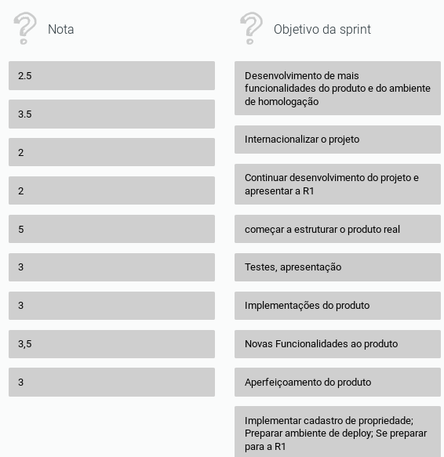
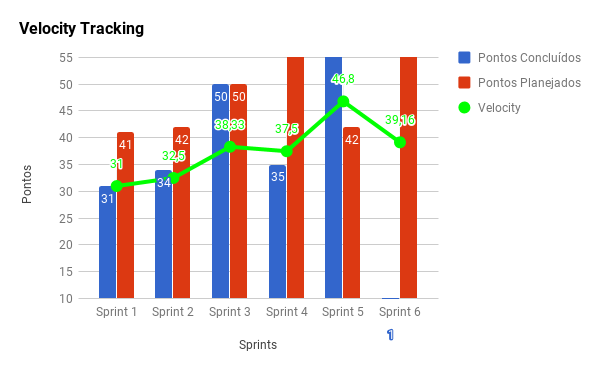
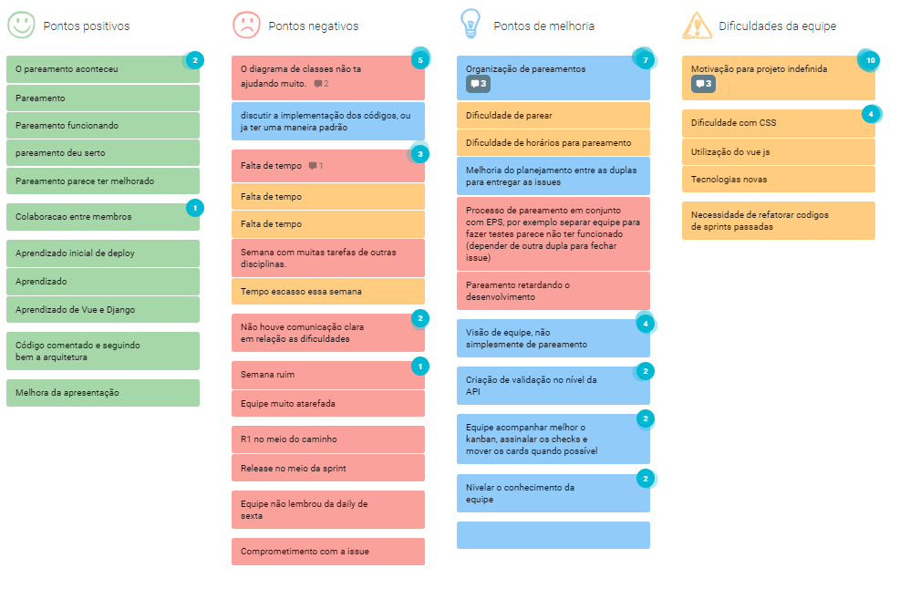

# Sprint 6

## Histórico de revisão
| Data   | Versão | Modificação  | Autor  |
| :- | :- | :- | :- |
| 12/10/2019 | 0.1 | Adição do planejamento  |  Fabíola |
| 15/10/2019 | 0.2 | Adição da Qualidade do Trabalho, práticas ágeis, quadro de conhecimento, health check, review e velocity |  Shayane |
| 18/10/2019 | 0.2 | Pequenas correções, adição da análise e da retrospectiva |  Fabíola |

# Planning da Sprint 6

- Período : 07/10 a 12/10

- Objetivo: Desenvolvimento do produto e automatização de processos de desenvolvimento.

## Issues

| ID | Descrição | Estimativa | Label |
| ---|-----------|------------|-------|
| #79 | Configurar ambiente de homologação | 20 | EPS |
| #105 | Documentação da Sprint 5 | 5 | EPS |
| #40 | Internacionalização do produto | 8 | MDS |
| #73 | Atualizar perfil do Usuário | 38 | MDS |
| #66 | Cadastrar propriedade| 56 | MDS | 
| #93 | Refatorar requisitos no documento de visão | 1 | MDS |

# Dívida alocada

ID | Descrição | Estimativa | Label|
---|-----------|------------|-------|
| #79 | Configurar ambiente de homologação | 20 | EPS |
| #105 | Documentação da Sprint 5 | 5 | EPS |
| #40 | Internacionalização do produto | 8 | MDS |
| #73 | Atualizar perfil do Usuário | 38 | MDS |
| #66 | Cadastrar propriedade| 56 | MDS | 

 - Total de pontos planejados: 127pts (mais 1 pts de dívida).
 - Total de pontos entregues: 1pts.

 # Possíveis riscos mapeados para a sprint

# Review

- Objetivo Alcançado? Não. Apesar da equipe ter entendido como se daria a solução, por diversos motivos como falta de tempo, não houve a conclusão da maioria das issues desta sprint.

- Estimativa correta? A estimativa das issues de codificação foi baseada na complexidade (BCP). A estimativa BCP pareceu não ser suficiente para o atual estado da equipe de desenvolvimento, por se tratar de complexidade. As issues técnicas com estimativa de pontuação por Fibonacci refletiram no esforço já previsto. 

- Tarefas bem distribuidas? Não. Houve a tentativa de modificação do processo de pareamento, com o objetivo de inclusão de todos os membros, em relação aos membros de EPS. Logo, foi segregada uma dupla para a realização dos testes no backend, mas esta ação gerou dependência e ociosidade durante a semana. Em relação às escolhas de pareamentos, o foco deu-se no nível de conhecimento entre os membros.

## Qualidade do Trabalho Entregue

Segundo a equipe a qualidade entregue foi de **3.05** considerando a escala de likert com os valores de 1 a 5.

## Velocity

# Retrospectiva

Segue imagem com todos as questões levantadas durante a retrospectiva.

Como um ponto que foi discutido e trazido diversas vezes, a "Motivação para o projeto indefinida" a equipe questionou a falta de entendimento do contexto dos usuários e o distanciamento em relação a ele. Para amenizar o problema e ter uma discussão mais direcionada, foi construído um mapa de empatia em equipe, traçando o perfil de um proprietário de uma colheita, tendo como resultado a imagem a seguir.

# Práticas ágeis 

# Quadro de Conhecimento

# Squad Health Check

# Análise da Scrum Master

Repetiu-se nessa sprint o não mapeamento de tarefas que estavam realizadas. Com a release 1 marcada para o meio da sprint, os membros de MDS utilizaram de tempo para realização de ensaios, o que não ficou registrado. Durante a sprint a Scrum Master teve que se afastar por problemas de saúde. Algumas tarefas, como a "Configuração do ambiente de homologação" eram tarefas muito grandes, que poderiam ter sido divididas em tarefas menores e melhor alocadas. A equipe de MDS avançou seu conhecimento sobre as tecnologias usadas no desenvolvimento.

